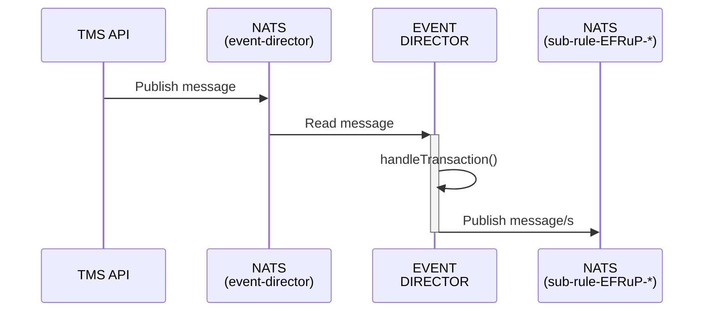
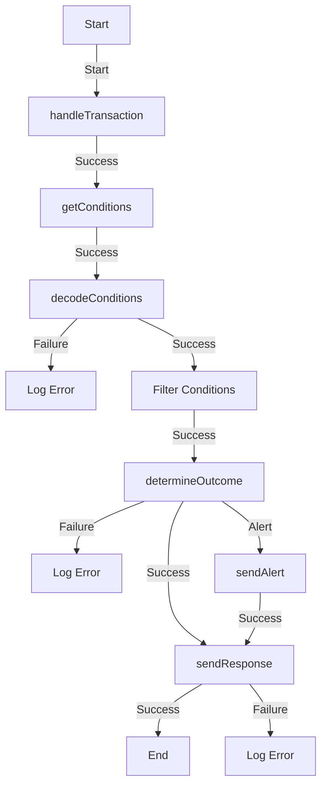

<!-- SPDX-License-Identifier: Apache-2.0 -->

# Event-flow

## Overview
Specialized rule processor receives a message from the Event-Director and determines a result for a rule in a typology like a normal rule.

### Services

- [PostgresQL](https://www.postgresql.org/): Database Management
- [NATS](https://nats.io): Message queue
- [Redis](https://redis.io): Redis

You also need NodeJS to be installed in your system. The current [LTS](https://nodejs.org/en) should be suitable. Please open an issue if the application fails to build on the current LTS version. Unix platforms, you should be able to find `nodejs` in your package manager's repositories.

#### Setting Up

```sh
git clone https://github.com/tazama-lf/event-flow
cd event-flow
```
You then need to configure your environment: a [sample](.env.template) configuration file has been provided and you may adapt that to your environment. Copy it to `.env` and modify as needed:

```sh
cp .env.template .env
```
A [registry](https://github.com/tazama-lf/docs/blob/dev/Technical/processor-startup-config-registry.md) of environment variables is provided to provide more context for what each variable is used for.

#### Build and Start

```sh
npm i
npm run build
npm run start
```

#### Testing
```bash
npm run test
```

## Inputs
A message received from ED:
```js
{
  metaData: { traceParent: "00-4bf92f3577b34da6a3ce929d0e0e4736-00f067aa0ba902b7-01" }, // https://www.w3.org/TR/trace-context/#examples-of-http-traceparent-headers
  transaction: { TxTp: "pacs.002.001.12", "FIToFIPmtSts": { /* Pacs002 */ } },
  networkMap: { /* Network Map */ },
  DataCache: { /* cached data relevant to the transaction */ }
};
```

## Internal Process Flow
### Sequence Diagram



### Activity Diagram


## Outputs

The output is the input with an added [RuleResult](https://github.com/tazama-lf/frms-coe-lib/blob/dev/src/interfaces/rule/RuleResult.ts):

```js
{
  metaData: { traceParent: "00-4bf92f3577b34da6a3ce929d0e0e4736-00f067aa0ba902b7-01" }, // https://www.w3.org/TR/trace-context/#examples-of-http-traceparent-headers
  transaction: { TxTp: "pacs.002.001.12", "FIToFIPmtSts": { /* Pacs002 */ } },
  networkMap: { /* Network Map */ },
  DataCache: { /* cached data relevant to the transaction */ },
  ruleResult: { /* rule result */ }
};
```

## Publishing
EFRuP is standalone and does not require publishing like normal rules.

## Troubleshooting
- Ensure all required environmental variables are populated otherwise EFRuP will not start up correctly.
